<div align="center">

# 酷态科 10 Ultra · BLE 本地控制

**蓝牙直连 · 实时数据大屏 · 本地充电记录 · 小爱同学语音控制**

[](https://www.python.org/)
[](#系统要求)
[](LICENSE)

</div>

通过低功耗蓝牙（BLE）本地直连酷态科 10 Ultra 充电器，在电脑上提供实时数据大屏 Web 控制台，
并可接入巴法云，用小爱同学语音控制各端口开关。数据仅在本地流转，默认只监听 `127.0.0.1`。

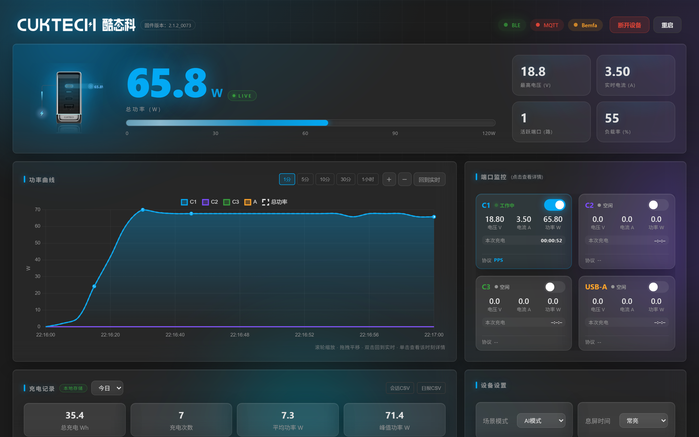

## 功能

- **实时数据大屏**：大数字总功率仪表、流动功率条、KPI 卡片，数值平滑刷新
- **实时功率曲线**：约 1 秒 1 帧；1 分 / 5 分 / 10 分 / 30 分 / 1 小时；滚轮缩放、拖拽平移、悬停 W·V·A、点击详情
- **端口监控**：C1 / C2 / C3 / USB-A 独立开关，实时电压 / 电流 / 功率、充电时长、协议识别，单端口详情
- **本地充电记录**：会话存入 SQLite，电量 / 时长 / 峰值统计，CSV 导出
- **智能管理**：最大充电时长、硬件倒计时、定时任务、低功率保护、功率告警
- **语音控制**：接入巴法云，经米家绑定后用小爱同学控制；同时支持 MQTT / Home Assistant
- **主题与多语言**：深色科技风磨砂玻璃，中英文，PC / 移动端适配

## 界面预览

| 实时功率曲线 | 单端口详情 |
| :---: | :---: |
| 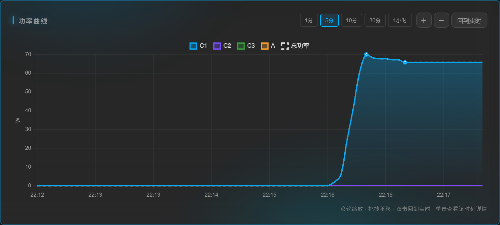 | 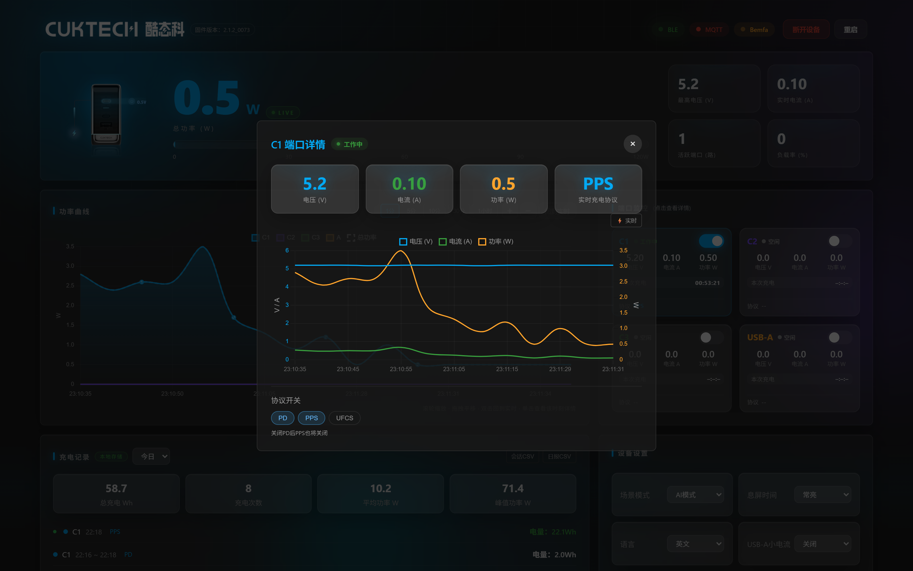 |
| 悬停 W·V·A | 点击详情卡 |
| 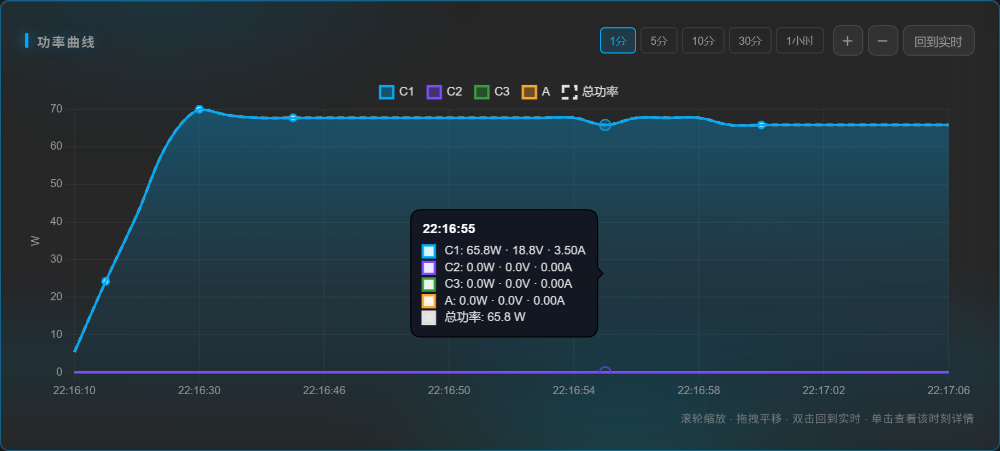 | 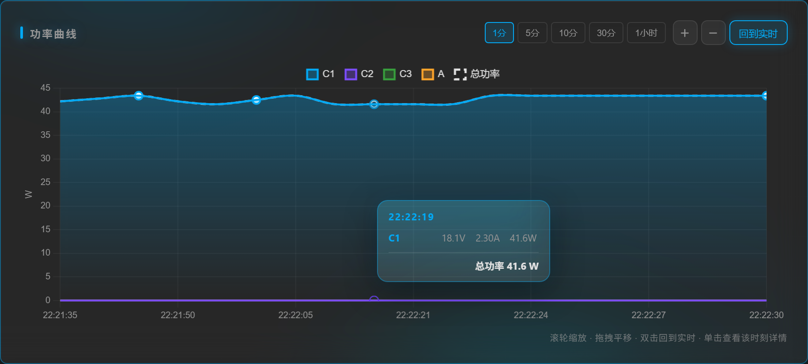 |
| 端口监控 | 定时控制 |
| 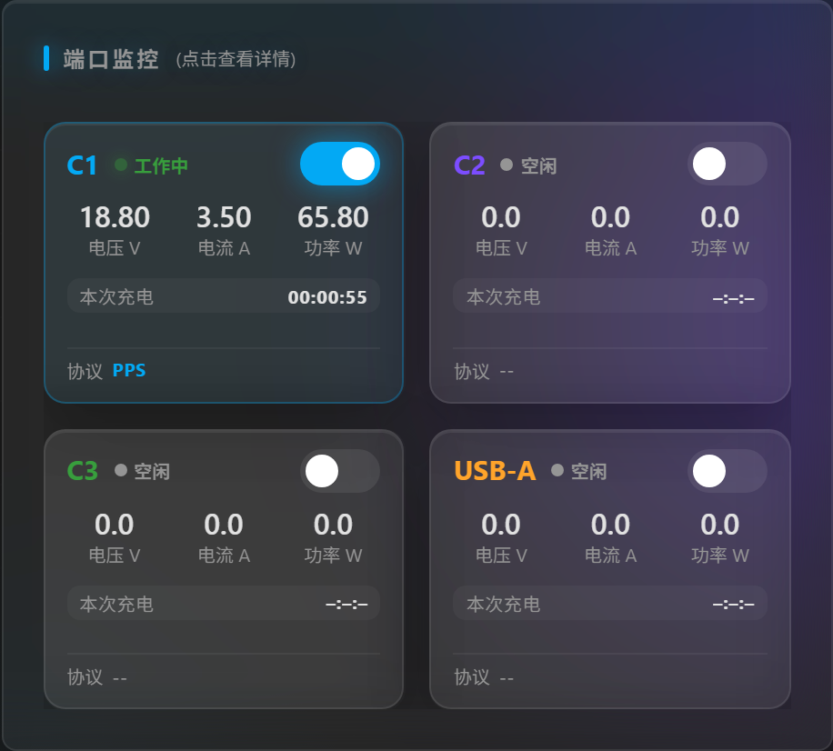 | 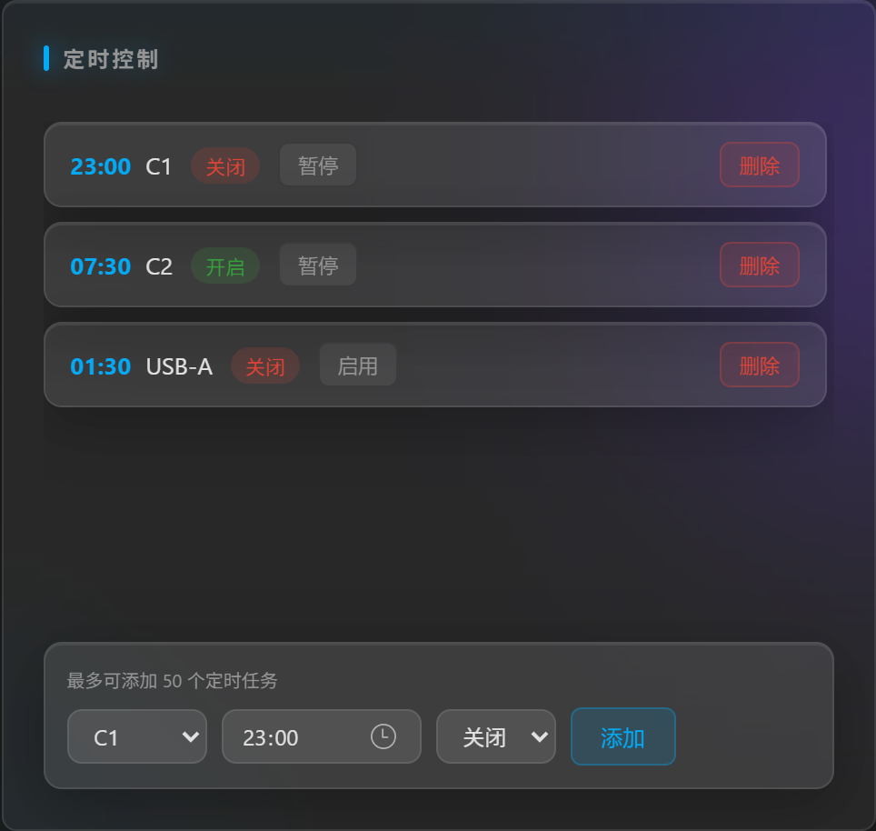 |
| 充电记录 | 会话详情 |
| 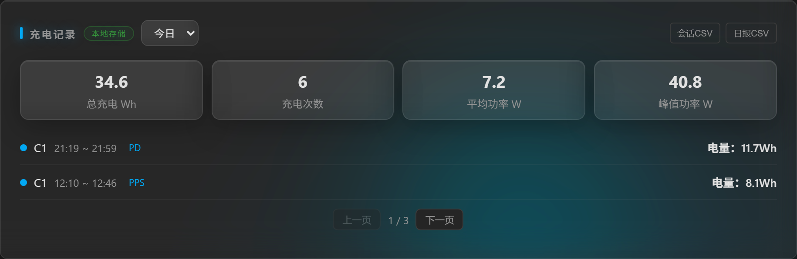 | 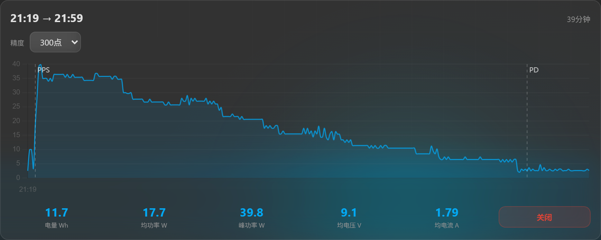 |
| 系统配置 | 移动端 |
| 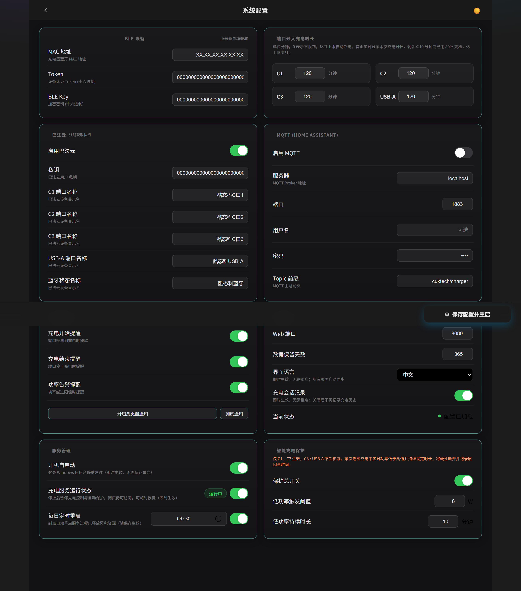 | 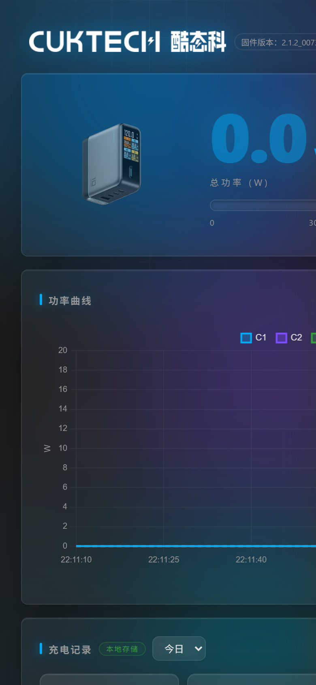 |

## 快速开始

**1. 获取设备参数（MAC / Token / BLE Key）**

```bash
git clone https://github.com/PiotrMachowski/Xiaomi-cloud-tokens-extractor.git
cd Xiaomi-cloud-tokens-extractor
pip install -r requirements.txt
python token_extractor.py
```

登录绑定充电器的小米账号（地区 `cn`），记下 MAC、Token、BLE Key。

**2. 安装本服务**

```bash
git clone https://github.com/NJ-CODE101/cuktech-ble-server.git
cd cuktech-ble-server
python -m venv venv
# Windows
.\venv\Scripts\python.exe -m pip install -r requirements.txt
# Linux
# ./venv/bin/pip install -r requirements.txt
```

**3. 填写配置**

```bash
cp config.yaml.example config.yaml   # Windows 用 Copy-Item
```

编辑 `config.yaml`：

```yaml
ble:
  mac: "XX:XX:XX:XX:XX:XX"
  token: "<你的 Token>"
  ble_key: "<你的 BLE Key>"
```

**4.（可选）接入小爱同学**

在 [巴法云](https://cloud.bemfa.com/) 注册并复制用户私钥，填入：

```yaml
bemfa:
  enabled: true
  uid: "<你的巴法云私钥>"
```

然后在米家 App **我的 → 其他平台设备 → 添加 → 巴法** 完成绑定，即可语音控制。

## 启动

```powershell
.\venv\Scripts\pythonw.exe ha_server.py   # Windows 后台
.\venv\Scripts\python.exe ha_server.py    # 调试
# Linux: ./venv/bin/python ha_server.py
```

启动后打开 <http://127.0.0.1:8080/>（配置页 `/config.html`）。
Windows 也可双击 `quick_start.vbs` 一键后台启动并打开浏览器。

## 系统要求

酷态科 10 Ultra（型号 `njcuk.fitting.ad1204`，固件实测 `2.1.2_0073`）、BLE 4.0+ 适配器、Python 3.9+。

## 技术栈

Python · aiohttp · bleak · paho-mqtt · PyYAML · SQLite；原生 ES2020 · Chart.js · SSE · 玻璃拟态 CSS · 中英文 i18n。

## 致谢

- 上游：[kairui1108/cuktech-ble-server](https://github.com/kairui1108/cuktech-ble-server)
- BLE 协议：[zhyzhaogit/cuktech-ble-controller](https://github.com/zhyzhaogit/cuktech-ble-controller)
- 协议检测：[zuyan9/ha-cuk-ble](https://github.com/zuyan9/ha-cuk-ble)
- Token 提取：[PiotrMachowski/Xiaomi-cloud-tokens-extractor](https://github.com/PiotrMachowski/Xiaomi-cloud-tokens-extractor)
- BLE 通信：[hbldh/bleak](https://github.com/hbldh/bleak)
- MQTT 客户端：[Eclipse Paho](https://eclipse.dev/paho/)

## 免责声明

个人学习自用项目，与 CUKTECH / 小米官方无关。请妥善保管 `config.yaml` 中的凭据，切勿公开。

## 许可证

[MIT](LICENSE)
